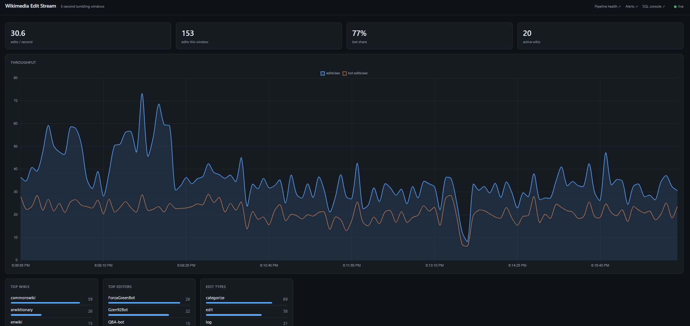
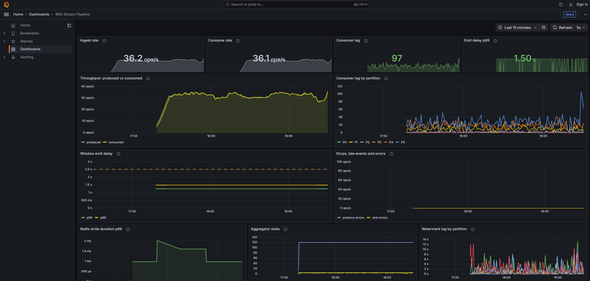
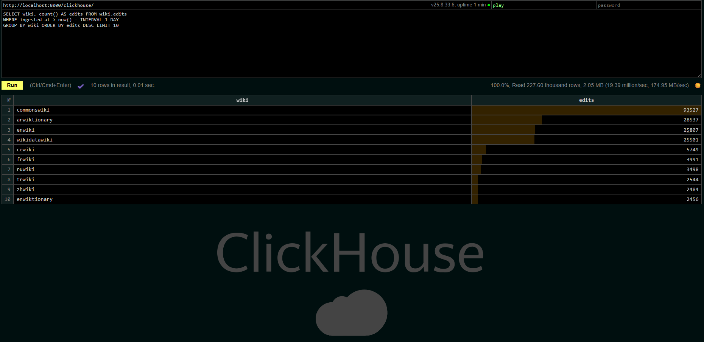

# Real-time Kafka Streaming Pipeline

Ingests Wikimedia's public edit firehose (~35 events/sec), aggregates it into
5-second tumbling windows, and serves the result to a live WebSocket dashboard.

The interesting part is not the topology — it is the delivery semantics. The
aggregator withholds Kafka offsets until the window a message landed in has been
durably written, and each window is stored in Redis as one field per Kafka
partition, so a `SIGKILL` mid-stream replays without losing or duplicating
anything and two aggregators can share the work without overwriting each other.
Every claim here was verified by running it — including three that turned out to
be wrong, which is what **[docs/DESIGN.md](docs/DESIGN.md)** is mostly about.

---

## Screenshots

**Live dashboard** — 5-second windows streamed over WebSocket: throughput, bot
share, top wikis, top editors and edit types.



**Pipeline health in Grafana** — ingest vs consume rate, consumer lag per
partition, window emit delay against the 2.5 s target, and write latency.



**SQL console over the cold path** — a day of Wikipedia edits aggregated over
227,600 rows in 0.01 s, running as a read-only user through the gateway.



---

## Architecture

```
Wikimedia SSE firehose
  (stream.wikimedia.org)
         │  text/event-stream
         ▼
  pipeline/producer/produce.py
  · validates + projects to 7 fields
  · keyed by wiki -> per-wiki ordering
  · idempotent producer, acks=all
         │
         ▼
  Kafka (KRaft, 6 partitions)  ──────┐
         │                            │
         ▼                            ▼
  pipeline/consumer/aggregator.py   [more group members:
  · window state per partition        each writes only the
  · epoch-aligned tumbling windows    partitions it owns]
  · arrival-time or watermark-driven
    event-time bucketing
  · commits offsets only after the
    window is written
         │
         ▼
       Redis
  · wiki:history      zset index of window starts
  · wiki:win:<start>  hash, one field per partition
         │
         ▼
  pipeline/api/server.py  (FastAPI)
  · /ws pushes each new window
         │
         ▼
  gateway (nginx) — localhost:8000
  · /              dashboard: Live and History tabs
  · /grafana/      pipeline health     ┐ with
  · /prometheus/   alerts and queries  ┘ --profile obs
```

---

## Quick start

```bash
docker compose up -d --build
```

That is the whole thing — Kafka, Redis, producer, aggregator, API and a gateway.
Health checks gate startup order, so nothing races the broker. Open
**http://localhost:8000**.

Add metrics with a profile, which pulls in Prometheus, Grafana and two exporters:

```bash
docker compose --profile obs up -d --build
```

Everything is served from that one address:

| Path | What |
|---|---|
| http://localhost:8000/ | the dashboard — **Live** (last 10 min, Redis) and **History** (up to 90 days, ClickHouse) |
| http://localhost:8000/grafana/ | pipeline health board, provisioned, no login |
| http://localhost:8000/prometheus/alerts | Prometheus and its eight alert rules |
| http://localhost:8000/clickhouse | SQL console over the cold path, read-only |

The dashboard header links to the others, and dims each link when that service
isn't running.

```bash
curl http://localhost:8000/healthz          # {"status":"ok",...,"partitions":6}
curl http://localhost:8000/api/latest       # full window summary
curl "http://localhost:8000/api/history?limit=20"
docker compose logs -f aggregator
docker compose down -v
```

> **Windows PowerShell:** `curl` there is an alias for `Invoke-WebRequest`, which
> rejects a URL with no scheme and returns a response object rather than the body.
> Use `curl.exe "http://..."` (bundled with Windows) or
> `Invoke-RestMethod "http://..."`, which parses the JSON for you.

### Analytics API

The live routes above read Redis: the last ten minutes. These read ClickHouse,
which keeps a week of raw events and months of rollups.

| Route | Answers | Reads |
|---|---|---|
| `GET /api/analytics/timeline?range=24h&bucket=1h` | edits, bots, new pages, editors per bucket | minute or daily rollup |
| `GET /api/analytics/top-wikis?range=7d&limit=10` | busiest wikis over a rolling window | minute rollup |
| `GET /api/analytics/top-editors?range=24h&limit=10` | most active editors | raw events |

`range` is one of `1h 6h 24h 7d 30d 90d`; `bucket` one of `1m 5m 1h 1d`. A request
that can't be answered as asked is a **400 with the reason** — `30d` at `1m` is
43,200 points, top editors past raw retention would be silently partial — and
every value reaches ClickHouse as a bound parameter, never as SQL text.

A missing bucket in a timeline means the pipeline wasn't running, not that
Wikipedia had no edits; gaps are reported, not filled with zeros.

The two paths fail independently. With ClickHouse stopped, the analytics routes
return **503** while the dashboard, the live routes and `/healthz` stay 200; start
it again and the analytics recover on the next request, with no API restart.
`/healthz` reports the cold path under `cold_path` without letting it decide the
verdict.

The dashboard's **History** tab is built on these routes: ranges from `1h` to
`90d`, each at a resolution that keeps the chart readable (`1h` per minute, `7d`
hourly, `90d` daily), plotted as edits per minute so ranges compare directly.
Downtime shows as gaps. Top editors stops at 7 days, the raw-event retention, and
says so. With ClickHouse down the tab shows a banner and the Live tab carries on.
Links like `/#history/7d` open a range directly.

### Running it without Docker

```bash
python -m venv .venv && source .venv/bin/activate   # Windows: .venv\Scripts\activate
pip install -r requirements-dev.txt
cp .env.example .env

docker compose up -d kafka redis     # infrastructure only

python -m pipeline.producer.produce
python -m pipeline.consumer.aggregator
python -m pipeline.api.server
```

`kafka-python` 2.0.x cannot be imported on Python 3.12; `requirements.txt` pins
`>=2.2` for that reason.

---

## What it actually prints

Real output, not illustrative:

```
22:17:56 INFO  [22:17:50]    67 edits (  13.4/s) | wikidatawiki: 18, enwiki: 17, elwiktionary: 8 | bots: 33%
22:18:01 INFO  [22:17:55]   198 edits (  39.6/s) | commonswiki: 67, wikidatawiki: 42, enwiki: 29 | bots: 48%
22:18:06 INFO  [22:18:00]   176 edits (  35.2/s) | wikidatawiki: 77, commonswiki: 32, enwiki: 13 | bots: 44%
22:18:11 INFO  [22:18:05]   180 edits (  36.0/s) | wikidatawiki: 60, commonswiki: 46, enwiki: 20 | bots: 42%
```

The firehose runs at roughly **30–50 edits/sec**, so a 5-second window holds
~150–250 edits. `wikidatawiki` and `commonswiki` are about half the volume, and
bots are typically 40–50%.

---

## Testing

```bash
pytest                    # 236 tests
pytest --cov              # 100% on window.py, offsets.py, sink.py, merge.py
ruff check .
mypy                      # clean across pipeline/ and tests/
```

The sink tests run against a **real Redis** rather than a fake, because the
property under test — that a rewritten window overwrites in place — depends on
Redis's own semantics and on a Lua script keeping two keys in step. A fake would
only test my model of Redis. They skip automatically if Redis is not up.

CI runs lint and tests on Python 3.11 and 3.12, then builds the stack and blocks
until `/healthz` reports a live window, so a broken pipeline fails the build
rather than only a broken unit.

The sink tests use Redis database 15, not the 0 the pipeline runs on, because
their fixtures delete every window key they touch — sharing db 0 with a running
stack silently wiped the live dashboard's history.

---

## Observability

The app dashboard on :8000 shows Wikipedia's edit data. The Grafana board shows
whether *this pipeline* is keeping up — a deliberately separate failure domain,
because the app dashboard reads through the aggregator's own output and goes
blank exactly when something breaks.

| Signal | Source | Steady state (measured) |
|---|---|---|
| Ingest vs consume rate | app counters | ~28/s each, tracking |
| Consumer lag per partition | `kafka-exporter` | ~90–110 total |
| Window emit delay p50/p99 | app histogram | p99 **1.5 s** against a 2.5 s target |
| Drops, late events, produce errors | app counters | 0 |
| Redis write duration p99 | app histogram | ~2.5 ms |
| Partitions covered, open windows | app gauges | 6 partitions, a handful of windows |

Three decisions behind it worth knowing:

- **Lag is measured from the broker, not from inside the aggregator.** An in-app
  lag metric disappears exactly when the aggregator dies, which is when you need
  it. `kafka-exporter` keeps reporting through an outage.
- **Counters, not gauges, for anything event-driven.** Windows are 5 s and the
  scrape interval is 5 s, so a gauge changing per window can be missed between
  scrapes. `rate()` over a counter loses nothing.
- **`partition` is the only per-series label.** It has six values. `wiki` has
  hundreds and would multiply every series by that — per-wiki counts stay in
  Redis, where they already are.

Consumer lag never sits at zero, and that is by design: offsets are not
committed until the window they fed has been written, so a steady baseline of
roughly one window per partition is the system working correctly. An alert on
"lag > 0" would fire forever; the rule uses 2000.

Reading the board: the top row is four headline numbers, the rows below are the
same signals over time. Every panel carries an ⓘ describing what it shows and
what normal looks like. The one to know is *Consumer lag by partition* — P3 and
P5 ride far above the rest because keying by wiki puts 86% of the traffic there.
The Demos section below makes the whole board move.

Scrape targets are discovered by DNS, so `--scale aggregator=3` is picked up
with no config change. To check the stack is fully wired:

```bash
bash scripts/wait_for_targets.sh      # blocks until all 6 targets scrape clean
```

CI runs that same script, so a broken metrics config fails the build rather than
silently producing an empty dashboard.

### One front door, separate processes

Grafana and Prometheus are reached through an nginx gateway at `/grafana/` and
`/prometheus/` rather than on ports of their own, but they are deliberately not
folded into the app. A monitoring view has to keep working when the thing it
watches breaks, and the gateway only routes. Measured:

| Stopped | `/` | `/grafana/` | `/prometheus/` |
|---|---|---|---|
| nothing | 200 | 200 | 200 |
| the API | **502** | 200 | 200 |
| the obs profile | 200 | 503, with the command to start it | 503, with the command to start it |

```bash
bash scripts/check_gateway.sh      # every route answers, and /metrics stays hidden
bash scripts/check_cold_path.sh    # rows landing in ClickHouse, fresh, nothing dead-lettered
```

The gateway resolves its upstreams per request instead of at startup, which is
why it boots happily without the obs profile rather than refusing to start over
a hostname it can't find.

---

## Demos

Three things worth showing, in the order that tells the best story. Each one is
reversible and none of them lose data.

### 1. Watch it fall behind, then catch up

Open Grafana first, then freeze the consumer while the producer keeps running:

```bash
docker compose pause aggregator     # SIGSTOP — frozen, not killed
# watch for ~90 seconds, then
docker compose unpause aggregator
```

**Consume rate** drops to zero while ingest carries on unchanged, and
**consumer lag** climbs at the ingest rate. Watching
[localhost:8000/prometheus/alerts](http://localhost:8000/prometheus/alerts) alongside, a measured run:

| Elapsed | Lag | Alerts |
|---|---|---|
| t+20s | 949 | `TargetDown` pending |
| t+80s | 3,522 | **`TargetDown` firing** |
| t+140s | 6,176 | **`PipelineStalled` firing** |
| t+200s | 8,637 | **`ConsumerLagHigh` firing** |
| unpause | 8,637 → 205 in ~25s | all resolve |

So a 90-second pause is enough to show lag climbing and the first alert firing;
give it three and a half minutes to see all three.

The detail worth pointing at: while the aggregator is frozen, its own `/metrics`
target goes **down** — and the lag graph keeps updating anyway. Lag is read from
the broker by `kafka-exporter` precisely so that it outlives the thing it
measures.

`TargetDown` exists because of a bug this demo found. The original stall rule
was `sum(rate(wiki_windows_emitted_total[1m])) == 0`, which cannot match a *dead*
process: no series, empty vector, nothing to compare to zero. A frozen aggregator
left it `inactive` for 250 seconds. `up == 0` catches the process being gone;
the stall rule now also carries an `absent()` arm and covers the other shape of
failure — alive and scrapeable, but not emitting.

### 2. Crash recovery

`SIGKILL` skips every shutdown path, so this is a real crash rather than a clean
stop:

```bash
docker compose kill -s SIGKILL aggregator
sleep 15
docker compose start aggregator
curl "http://localhost:8000/api/history?limit=30"
```

History comes back with **no duplicate timestamps** and a gap the length of the
downtime. In the default `arrival` mode the replayed backlog lands in the window
open at restart, so there is also one inflated window — a measured run gave 1055
edits against a median of 201. In `event` mode the backlog is reattributed to its
original windows and history is fully contiguous instead. Which you want, and
why, is [§3 of the design notes](docs/DESIGN.md).

`docker compose kill` leaves the container exited: the `unless-stopped` restart
policy does not resurrect it, so the explicit `start` is required.

### 3. Scale out

```bash
docker compose up -d --scale aggregator=2
docker compose logs aggregator | grep edits    # each replica logs its own share
curl http://localhost:8000/api/latest          # the API serves the merged window
docker compose up -d --scale aggregator=1      # back to one
```

Kafka splits the six partitions across the group, and each replica writes only
the Redis fields for the partitions it owns, so their work composes rather than
collides. Measured with two replicas: 20 + 199 = 219, 11 + 228 = 239,
12 + 231 = 243 — the merged totals match the replicas' own logs exactly, and
"partitions covered" on the Grafana board stays at 6 throughout.

This did not use to work. Both replicas wrote the same key and the last one won,
silently undercounting every window; [§5.3 of the design
notes](docs/DESIGN.md) has the numbers and the fix.

### Which interruption to use

| Command | Signal | Container | Good for |
|---|---|---|---|
| `pause` / `unpause` | SIGSTOP | frozen, still up | the lag demo — instant and reversible |
| `stop` / `start` | SIGTERM, then KILL after 10s | exits cleanly | the graceful path: flushes and logs its counters |
| `kill -s SIGKILL` | SIGKILL | exits immediately | the crash test — no cleanup, forces a replay |

All three need an explicit `start` or `unpause` afterwards.

---

## Configuration

Every setting is an environment variable; see [.env.example](.env.example).

| Variable | Default | Notes |
|---|---|---|
| `KAFKA_BOOTSTRAP_SERVERS` | `localhost:9092` | `kafka:29092` inside compose |
| `KAFKA_PARTITIONS` | `6` | Created explicitly; auto-creation gives 1 |
| `WINDOW_SECONDS` | `5` | Windows are epoch-aligned |
| `WINDOW_GRACE_SECONDS` | `1.0` | How long a closed window waits for stragglers |
| `WINDOW_TIME_SOURCE` | `arrival` | `arrival` or `event` — see design notes |
| `HISTORY_MAX` | `120` | Windows retained (10 minutes at 5s) |
| `STALE_AFTER_SECONDS` | `30` | `/healthz` degrades when the newest window is older |

---

## Project layout

```
gateway/nginx.conf         single front door: /, /grafana/, /prometheus/, /clickhouse/
clickhouse/
├── init/01_raw.sql        raw events (7d) and the dead-letter table
├── init/02_rollups.sql    per-minute (90d) and per-day rollups
├── init/03_kafka_source.sql  Kafka engine ingest - must sort last
├── config.d/, users.d/    metrics endpoint, memory cap, read-only console user
observability/            Prometheus config, alert rules, Grafana dashboard
scripts/                   stack checks, run by CI and runnable by hand
pipeline/
├── config.py              env-driven configuration
├── analytics.py           cold-path queries, validated and parameter-bound
├── merge.py               summing per-partition window slices
├── metrics.py             Prometheus metric definitions
├── producer/produce.py    SSE -> Kafka, keyed by wiki
├── consumer/
│   ├── window.py          TumblingWindow + WindowManager (watermarks, gaps)
│   ├── offsets.py         commit-after-write bookkeeping
│   ├── sink.py            idempotent, partition-scoped Redis writer (Lua)
│   └── aggregator.py      the consume loop, window state per partition
└── api/
    ├── server.py          FastAPI: live and analytics routes, WebSocket
    └── static/index.html  dashboard
tests/                     236 tests
docs/DESIGN.md             semantics, trade-offs, measurements
docker/Dockerfile          one image, three entrypoints
```

---

## Known limitations

Kept honest and current in [§6 of the design notes](docs/DESIGN.md). The
short version: top-5 editors is approximate when several aggregators share the
topic (totals and per-wiki counts stay exact), there is no rebalance listener,
the watermark has no idle timeout, alerts are defined but not routed anywhere,
and Redis history is a rolling 10-minute window with no durable store behind it.

## Roadmap

- A rebalance listener wired to `OffsetTracker.forget()`
- Kafka offsets stored in the sink's Lua script, for true exactly-once
- Alertmanager, so the rules in `observability/alerts.yml` route somewhere
- Load-generator mode replaying a captured file at N× speed, with a measured
  throughput/latency table
- Schema Registry + Avro, with a compatibility check in CI
- A dead-letter topic for malformed events
- A durable sink (ClickHouse or TimescaleDB) for history beyond the rolling window
